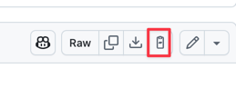

# GitHub Raw Link Copier

🚀 A minimalist Chrome extension that adds a **"Copy Raw Link"** button on GitHub file pages, allowing you to copy the direct `raw.githubusercontent.com` URL in one click.

---

## ✨ Features

- 📎 Adds a GitHub-style button beside the existing **Raw** button
- 📋 Copies the **true raw content URL** (`raw.githubusercontent.com/...`)
- 🧠 Automatically adapts to GitHub’s dynamic page loading
- 💡 Uses lightweight inline SVG (no external image loading)
- 🛡️ No user data collection, no tracking

---

## 📸 Screenshot

> You’ll see an additional 📎 button next to GitHub’s "Raw" button.  
> Clicking it copies the actual raw link, perfect for automation scripts, curl, or downloading content directly.


---

## 🔧 Installation

### 🅰️ From Chrome Web Store *(coming soon)*

> To be published soon…

---

## 🅱️ Manual Install

### 🔻 Option A: Download ZIP

[📦 Click here to download the latest ZIP](https://github.com/Yuanhuafei/github-raw-link-copier/releases/latest)
1. Extract the downloaded '.zip 'file
2. Open Chrome and go to `chrome://extensions/`.
3. Enable **Developer mode** (top right).
4. Click **"Load unpacked"** and select the folder you downloaded.
5. Visit any GitHub file page and look for the new 📎 button!

---

### 🛠 Option B: Clone from GitHub

```bash
git clone https://github.com/yourusername/github-raw-link-copier.git
cd github-raw-link-copier
```
Repeat steps 2 to 5

---
## 📄 License

This project is licensed under the MIT License - see the [LICENSE](LICENSE) file for details
